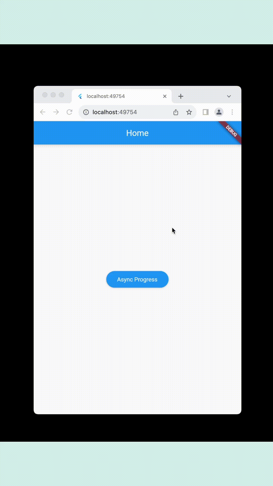

# AsyncButton

A Flutter package that provides an asynchronous button widget with customizable properties.

## Features

- Asynchronous operation support.
- Customizable text, color, icon, and dimensions.
- Progress indicator during async operations.

## Getting Started

To use this package, add `async_progress_button` as a dependency in your pubspec.yaml file.

## Usage

Here is a basic example of how to use the AsyncButton widget:

```dart
AsyncButton(
  text: 'Click Me',
  onPressed: () async {
    // Your async operation here
  },
)
```




